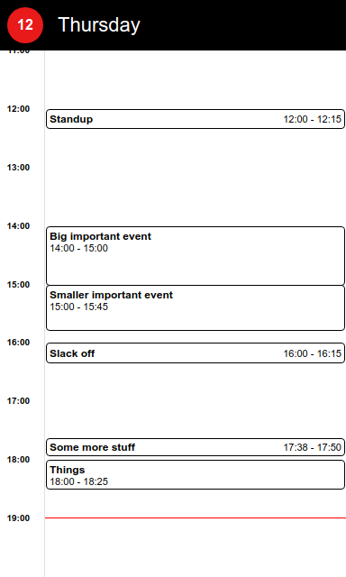

# Calumny

Calumny is a calendar renderer for e-ink displays. It's meant to render your calendar
from an iCal export, so you can display it on any kind of e-ink display. It's designed
for high-contrast viewing, with black-and-white or three-color displays.

Here's an example of how the rendered calendar looks:

